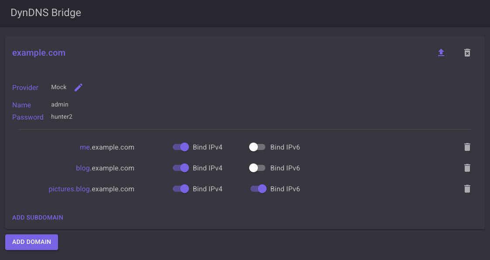

# A self-hosted DynDNS provider

Configure your dynamic DNS entries and have your router update them automatically when your public IP address changes -
no account required! Just you and your trusty, little server.

## Supported DNS providers

- Hetzner

.. that's it. Sorry.

## Setup

Run the webhost either directly or through docker and make sure it's accessible from within your network, but not from the outside.
We'll assume whatever you host the webhost on is accessible in your network as `http://<your-ip>:<your-port>`.
Check out the [docker-compose.yaml](./build/docker-compose.yaml) if you want to work with `docker compose`.

In your router, head to the DynDNS configuration and enter the following:

- Provider: custom
- Update URL: `http://<your-ip>:<your-port>/api/v1/refresh`
- Domain: Not used, just enter whatever
- Username: Not used, just enter whatever
- Password: Not used, just enter whatever

Then, head to `http://<your-ip>:<your-port>/` in your browser and configure your bindings.

That's it! If done correctly, it should all just work right away. You can press the "upload" icon next to the "delete" icon
to force-refresh the binding on your provider or wait until the DynDNS module of your router kicks in and triggers the update.

## Notes

This is just a little something I've built for myself. There's no fancy logging (yet), no sane error handling (yet) or
any other sensible features you'd expect a production-grade application to have.

But it does what it needs to do for my case, so I'm happy.

### Security considerations

The API-Key is stored unencrypted within the container. Since this project has the sole purpose of pointing the whole web at your home network,
make sure that nobody can access the API-Key just by connecting.
